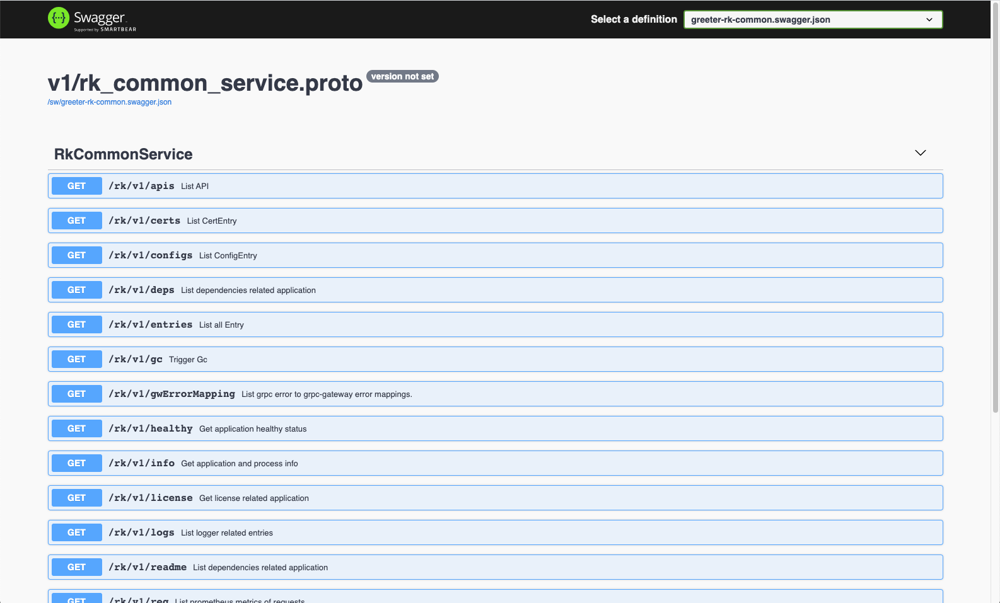
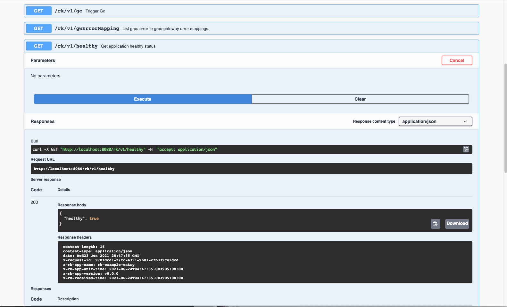
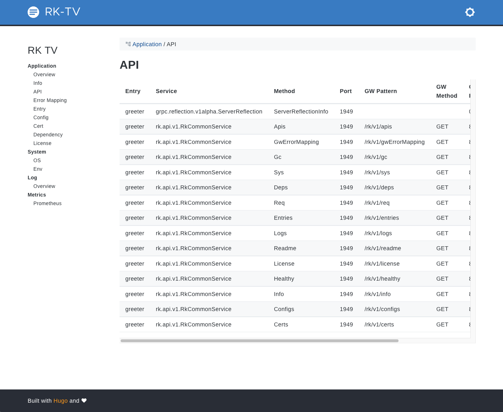
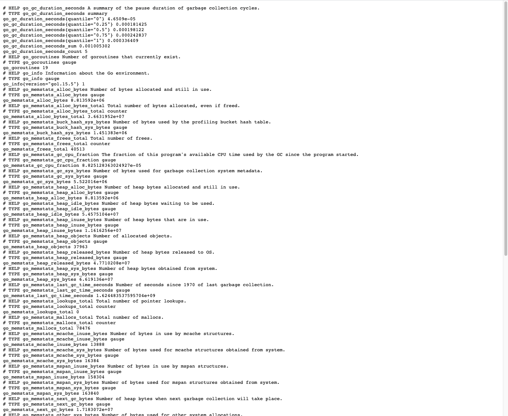

# rk-grpc
[](https://github.com/rookie-ninja/rk-grpc/actions/workflows/ci.yml)
[](https://codecov.io/gh/rookie-ninja/rk-grpc)
[](https://goreportcard.com/report/github.com/rookie-ninja/rk-grpc)
[](https://opensource.org/licenses/Apache-2.0)

Interceptor & bootstrapper designed for grpc. Currently, supports bellow functionalities.

| Name | Description |
| ---- | ---- |
| Start from YAML | Start service from YAML config. |
| Start from code | Start service from code. |
| gRPC Service | gRPC service defined with protocol buffer. |
| gRPC Gateway Service | gRPC Gateway service with same port. |
| Swagger Service | Swagger UI with same port as gRPC Gateway. |
| Common Service | List of common API available on gRPC, gRPC Gateway and swagger. |
| TV Service | A Web UI shows application and environment information. |
| Metrics interceptor | Collect RPC metrics and export as prometheus client with same port of gRPC gateway. |
| Log interceptor | Log every RPC requests as event with rk-query. |
| Trace interceptor | Collect RPC trace and export it to stdout, file or jaeger. |
| Panic interceptor | Recover from panic for RPC requests and log it. |
| Meta interceptor | Send application metadata as header to client and gRPC Gateway. |
| Auth interceptor | Support [Basic Auth] and [API Key] authorization types. |
| RateLimit interceptor | Limit request rate from interceptor. |
| Timeout interceptor | Timing out request by configuration. |
| CORS interceptor | CORS interceptor for grpc-gateway. |
| JWT interceptor | JWT interceptor on server side. |
| Secure interceptor | Secure interceptor for grpc-gateway. |
| CSRF interceptor | CSRF interceptor for grpc-gateway. |

<!-- START doctoc generated TOC please keep comment here to allow auto update -->
<!-- DON'T EDIT THIS SECTION, INSTEAD RE-RUN doctoc TO UPDATE -->
**Table of Contents**  *generated with [DocToc](https://github.com/thlorenz/doctoc)*

- [Installation](#installation)
- [Quick Start](#quick-start)
  - [Start gRPC Service](#start-grpc-service)
  - [Output](#output)
    - [gRPC Service](#grpc-service)
    - [gRPC Gateway Service](#grpc-gateway-service)
    - [Swagger Service](#swagger-service)
    - [Common Service](#common-service)
    - [TV Service](#tv-service)
    - [Metrics](#metrics)
    - [Logging](#logging)
    - [Meta](#meta)
- [YAML Config](#yaml-config)
  - [gRPC Service](#grpc-service-1)
  - [gRPC gateway options](#grpc-gateway-options)
  - [Common Service](#common-service-1)
  - [Prom Client](#prom-client)
  - [TV Service](#tv-service-1)
  - [Swagger Service](#swagger-service-1)
  - [Interceptors](#interceptors)
    - [Log](#log)
    - [Metrics](#metrics-1)
    - [Auth](#auth)
    - [Meta](#meta-1)
    - [Tracing](#tracing)
    - [RateLimit](#ratelimit)
    - [Timeout](#timeout)
    - [CORS](#cors)
    - [JWT](#jwt)
    - [Secure](#secure)
    - [CSRF](#csrf)
- [Development Status: Stable](#development-status-stable)
- [Build instruction](#build-instruction)
- [Test instruction](#test-instruction)
- [Dependencies](#dependencies)
- [Contributing](#contributing)

<!-- END doctoc generated TOC please keep comment here to allow auto update -->

## Installation
`go get github.com/rookie-ninja/rk-grpc`

## Quick Start
Bootstrapper can be used with YAML config. In the bellow example, we will start bellow services automatically.
- gRPC Service
- gRPC Server Reflection
- gRPC Gateway Service(By default, gateway is always open)
- Swagger Service
- Common Service
- TV Service
- Metrics
- Logging
- Meta

Please refer example at [example/boot/simple](example/boot/simple).

### Start gRPC Service
- [boot.yaml](example/boot/simple/boot.yaml)

```yaml
---
grpc:
  - name: greeter
    enabled: true
    port: 8080
    enableReflection: true
    enableRkGwOption: true
    commonService:
      enabled: true
    tv:
      enabled: true
    sw:
      enabled: true
    prom:
      enabled: true
#    interceptors:
#      loggingZap:
#        enabled: true
#      metricsProm:
#        enabled: true
#      meta:
#        enabled: true
```
- [main.go](example/boot/simple/main.go)

```go
func main() {
    // Bootstrap basic entries from boot config.
    rkentry.RegisterInternalEntriesFromConfig("example/boot/simple/boot.yaml")

    // Bootstrap grpc entry from boot config
    res := rkgrpc.RegisterGrpcEntriesWithConfig("example/boot/simple/boot.yaml")

    // Bootstrap gin entry
    res["greeter"].Bootstrap(context.Background())

    // Wait for shutdown signal
    rkentry.GlobalAppCtx.WaitForShutdownSig()

    // Interrupt gin entry
    res["greeter"].Interrupt(context.Background())
}
```

```go
$ go run main.go
```

### Output
#### gRPC Service
Try to test gRPC Service with [grpcurl](https://github.com/fullstorydev/grpcurl)
```shell script
# List grpc services at port 8080 without TLS
# Expect RkCommonService since we enabled common services.
$ grpcurl -plaintext localhost:8080 list                           
grpc.reflection.v1alpha.ServerReflection
rk.api.v1.RkCommonService

# List grpc methods in rk.api.v1.RkCommonService
$ grpcurl -plaintext localhost:8080 list rk.api.v1.RkCommonService            
rk.api.v1.RkCommonService.Apis
rk.api.v1.RkCommonService.Certs
rk.api.v1.RkCommonService.Configs
rk.api.v1.RkCommonService.Deps
rk.api.v1.RkCommonService.Entries
rk.api.v1.RkCommonService.Gc
rk.api.v1.RkCommonService.GwErrorMapping
rk.api.v1.RkCommonService.Healthy
rk.api.v1.RkCommonService.Info
rk.api.v1.RkCommonService.License
rk.api.v1.RkCommonService.Logs
rk.api.v1.RkCommonService.Readme
rk.api.v1.RkCommonService.Req
rk.api.v1.RkCommonService.Sys
rk.api.v1.RkCommonService.Git

# Send request to rk.api.v1.RkCommonService.Healthy
$ grpcurl -plaintext localhost:8080 rk.api.v1.RkCommonService.Healthy
{
    "healthy": true
}
```

#### gRPC Gateway Service
Gateway and gRPC will open at the same port. rk-grpc will automatically determine connection type between http and grpc
requests.
 
We will try to send request to common service API.

Gateway to gRPC mapping defined at [gw-mapping](boot/api/v1/gw_mapping.yaml)
```shell script
$ curl localhost:8080/rk/v1/healthy
{"healthy":true}
```

#### Swagger Service
By default, we could access swagger UI at [/sw].
- http://localhost:8080/sw



#### Common Service
We can access common service both from Gateway and gRPC.



#### TV Service
By default, we could access TV at [/tv].



#### Metrics
By default, we could access prometheus client at [/metrics]
- http://localhost:8080/metrics



#### Logging
By default, we enable zap logger and event logger with console encoding type.
```shell script
2021-09-11T04:43:23.216+0800    INFO    boot/common_service_entry.go:133        Bootstrapping CommonServiceEntry.       {"eventId": "2df7fa50-3d1f-44cb-9db6-c4c26d9a29ce", "entryName": "greeter", "entryType": "GrpcCommonServiceEntry"}
2021-09-11T04:43:23.217+0800    INFO    boot/sw_entry.go:208    Bootstrapping SwEntry.  {"eventId": "2df7fa50-3d1f-44cb-9db6-c4c26d9a29ce", "entryName": "greeter", "entryType": "GrpcSwEntry", "swPath": "/sw/", "headers": {}}
2021-09-11T04:43:23.217+0800    INFO    boot/prom_entry.go:206  Bootstrapping promEntry.        {"eventId": "2df7fa50-3d1f-44cb-9db6-c4c26d9a29ce", "entryName": "greeter", "entryType": "GrpcPromEntry", "path": "/metrics", "port": 8080}
2021-09-11T04:43:23.217+0800    INFO    boot/tv_entry.go:178    Bootstrapping TvEntry.  {"eventId": "2df7fa50-3d1f-44cb-9db6-c4c26d9a29ce", "entryName": "greeter", "entryType": "GrpcTvEntry"}
2021-09-11T04:43:23.219+0800    INFO    boot/grpc_entry.go:829  Bootstrapping grpcEntry.        {"eventId": "2df7fa50-3d1f-44cb-9db6-c4c26d9a29ce", "entryName": "greeter", "entryType": "GrpcEntry", "port": 8080, "swEnabled": true, "tvEnabled": true, "promEnabled": true, "commonServiceEnabled": true, "tlsEnabled": false, "reflectionEnabled": true, "swPath": "/sw/", "headers": {}, "tvPath": "/rk/v1/tv"}
```
```shell script
------------------------------------------------------------------------
endTime=2021-09-11T04:43:23.217002+08:00
startTime=2021-09-11T04:43:23.216935+08:00
elapsedNano=67240
timezone=CST
ids={"eventId":"2df7fa50-3d1f-44cb-9db6-c4c26d9a29ce"}
app={"appName":"rk-grpc","appVersion":"master-bd63f29","entryName":"greeter","entryType":"GrpcCommonServiceEntry"}
env={"arch":"amd64","az":"*","domain":"*","hostname":"lark.local","localIP":"10.8.0.6","os":"darwin","realm":"*","region":"*"}
payloads={"entryName":"greeter","entryType":"GrpcCommonServiceEntry"}
error={}
counters={}
pairs={}
timing={}
remoteAddr=localhost
operation=bootstrap
resCode=OK
eventStatus=Ended
EOE
...
------------------------------------------------------------------------
endTime=2021-09-11T04:43:23.217156+08:00
startTime=2021-09-11T04:43:23.217145+08:00
elapsedNano=11496
timezone=CST
ids={"eventId":"2df7fa50-3d1f-44cb-9db6-c4c26d9a29ce"}
app={"appName":"rk-grpc","appVersion":"master-bd63f29","entryName":"greeter","entryType":"GrpcPromEntry"}
env={"arch":"amd64","az":"*","domain":"*","hostname":"lark.local","localIP":"10.8.0.6","os":"darwin","realm":"*","region":"*"}
payloads={"entryName":"greeter","entryType":"GrpcPromEntry","path":"/metrics","port":8080}
error={}
counters={}
pairs={}
timing={}
remoteAddr=localhost
operation=bootstrap
resCode=OK
eventStatus=Ended
EOE
```

#### Meta
By default, we will send back some metadata to client including gateway with headers.
```shell script
$ curl -vs localhost:8080/rk/v1/healthy
...
< HTTP/1.1 200 OK
< Content-Type: application/json
< X-Request-Id: cb615712-74dc-4e62-afb9-2fc6599bf452
< X-Rk-App-Name: rk-grpc
< X-Rk-App-Unix-Time: 2021-06-24T05:29:09.481073+08:00
< X-Rk-App-Version: master-xxx
< X-Rk-Received-Time: 2021-06-24T05:29:09.481073+08:00
< Date: Wed, 23 Jun 2021 21:29:09 GMT
...
```

## YAML Config
Available configuration
User can start multiple grpc servers at the same time. Please make sure use different port and name.

### gRPC Service
| name | description | type | default value |
| ------ | ------ | ------ | ------ |
| grpc.name | The name of grpc server | string | N/A |
| grpc.enabled | Enable grpc entry | bool | false |
| grpc.port | The port of grpc server | integer | nil, server won't start |
| grpc.description | Description of grpc entry. | string | "" |
| grpc.enableReflection | Enable grpc server reflection | boolean | false |
| grpc.enableRkGwOption | Enable RK style gateway server options. [detail](boot/gw_server_options.go) | false |
| grpc.noRecvMsgSizeLimit | Disable grpc server side receive message size limit | false |
| grpc.gwMappingFilePaths | The grpc gateway mapping file path. [example](boot/api/v1/gw_mapping.yaml) | string array | [] |
| grpc.cert.ref | Reference of cert entry declared in [cert entry](https://github.com/rookie-ninja/rk-entry#certentry) | string | "" |
| grpc.logger.zapLogger.ref | Reference of zapLoggerEntry declared in [zapLoggerEntry](https://github.com/rookie-ninja/rk-entry#zaploggerentry) | string | "" |
| grpc.logger.eventLogger.ref | Reference of eventLoggerEntry declared in [eventLoggerEntry](https://github.com/rookie-ninja/rk-entry#eventloggerentry) | string | "" |

### gRPC gateway options
Please refer to bellow repository for detailed explanations.
- [protobuf-go/encoding/protojson/encode.go](https://github.com/protocolbuffers/protobuf-go/blob/master/encoding/protojson/encode.go#L43)
- [protobuf-go/encoding/protojson/decode.go ](https://github.com/protocolbuffers/protobuf-go/blob/master/encoding/protojson/decode.go#L33)

| name | description | type | default value |
| ------ | ------ | ------ | ------ |
| grpc.gwOption.marshal.multiline | Enable multiline in grpc-gateway marshaller | bool | false |
| grpc.gwOption.marshal.emitUnpopulated | Enable emitUnpopulated in grpc-gateway marshaller | bool | false |
| grpc.gwOption.marshal.indent | Set indent in grpc-gateway marshaller | string | "  " |
| grpc.gwOption.marshal.allowPartial | Enable allowPartial in grpc-gateway marshaller | bool | false |
| grpc.gwOption.marshal.useProtoNames | Enable useProtoNames in grpc-gateway marshaller | bool | false |
| grpc.gwOption.marshal.useEnumNumbers | Enable useEnumNumbers in grpc-gateway marshaller | bool | false |
| grpc.gwOption.unmarshal.allowPartial | Enable allowPartial in grpc-gateway unmarshaler | bool | false |
| grpc.gwOption.unmarshal.discardUnknown | Enable discardUnknown in grpc-gateway unmarshaler | bool | false |

### Common Service
```yaml
http:
  rules:
    - selector: rk.api.v1.RkCommonService.Healthy
      get: /rk/v1/healthy
    - selector: rk.api.v1.RkCommonService.Gc
      get: /rk/v1/gc
    - selector: rk.api.v1.RkCommonService.Info
      get: /rk/v1/info
    - selector: rk.api.v1.RkCommonService.Configs
      get: /rk/v1/configs
    - selector: rk.api.v1.RkCommonService.Apis
      get: /rk/v1/apis
    - selector: rk.api.v1.RkCommonService.Sys
      get: /rk/v1/sys
    - selector: rk.api.v1.RkCommonService.Req
      get: /rk/v1/req
    - selector: rk.api.v1.RkCommonService.Entries
      get: /rk/v1/entries
    - selector: rk.api.v1.RkCommonService.Certs
      get: /rk/v1/certs
    - selector: rk.api.v1.RkCommonService.Logs
      get: /rk/v1/logs
    - selector: rk.api.v1.RkCommonService.Deps
      get: /rk/v1/deps
    - selector: rk.api.v1.RkCommonService.License
      get: /rk/v1/license
    - selector: rk.api.v1.RkCommonService.Readme
      get: /rk/v1/readme
    - selector: rk.api.v1.RkCommonService.Git
      get: /rk/v1/git
    - selector: rk.api.v1.RkCommonService.GwErrorMapping
      get: /rk/v1/gwErrorMapping
```

| name | description | type | default value |
| ------ | ------ | ------ | ------ |
| grpc.commonService.enabled | Enable embedded common service | boolean | false |

### Prom Client
| name | description | type | default value |
| ------ | ------ | ------ | ------ |
| grpc.prom.enabled | Enable prometheus | boolean | false |
| grpc.prom.path | Path of prometheus | string | /metrics |
| grpc.prom.pusher.enabled | Enable prometheus pusher | bool | false |
| grpc.prom.pusher.jobName | Job name would be attached as label while pushing to remote pushgateway | string | "" |
| grpc.prom.pusher.remoteAddress | PushGateWay address, could be form of http://x.x.x.x or x.x.x.x | string | "" |
| grpc.prom.pusher.intervalMs | Push interval in milliseconds | string | 1000 |
| grpc.prom.pusher.basicAuth | Basic auth used to interact with remote pushgateway, form of [user:pass] | string | "" |
| grpc.prom.pusher.cert.ref | Reference of rkentry.CertEntry | string | "" |

### TV Service
| name | description | type | default value |
| ------ | ------ | ------ | ------ |
| grpc.tv.enabled | Enable RK TV | boolean | false |

### Swagger Service
| name | description | type | default value |
| ------ | ------ | ------ | ------ |
| grpc.sw.enabled | Enable swagger service over gRpc server | boolean | false |
| grpc.sw.path | The path access swagger service from web | string | /sw |
| grpc.sw.jsonPath | Where the swagger.json files are stored locally | string | "" |
| grpc.sw.headers | Headers would be sent to caller as scheme of [key:value] | []string | [] |

### Interceptors
#### Log
| name | description | type | default value |
| ------ | ------ | ------ | ------ |
| grpc.interceptors.loggingZap.enabled | Enable log interceptor | boolean | false |
| grpc.interceptors.loggingZap.zapLoggerEncoding | json or console | string | console |
| grpc.interceptors.loggingZap.zapLoggerOutputPaths | Output paths | []string | stdout |
| grpc.interceptors.loggingZap.eventLoggerEncoding | json or console | string | console |
| grpc.interceptors.loggingZap.eventLoggerOutputPaths | Output paths | []string | false |

We will log two types of log for every RPC call.
- zapLogger

Contains user printed logging with requestId or traceId.

- eventLogger

Contains per RPC metadata, response information, environment information and etc.

| Field | Description |
| ---- | ---- |
| endTime | As name described |
| startTime | As name described |
| elapsedNano | Elapsed time for RPC in nanoseconds |
| timezone | As name described |
| ids | Contains three different ids(eventId, requestId and traceId). If meta interceptor was enabled or event.SetRequestId() was called by user, then requestId would be attached. eventId would be the same as requestId if meta interceptor was enabled. If trace interceptor was enabled, then traceId would be attached. |
| app | Contains [appName, appVersion](https://github.com/rookie-ninja/rk-entry#appinfoentry), entryName, entryType. |
| env | Contains arch, az, domain, hostname, localIP, os, realm, region. realm, region, az, domain were retrieved from environment variable named as REALM, REGION, AZ and DOMAIN. "*" means empty environment variable.|
| payloads | Contains RPC related metadata |
| error | Contains errors if occur |
| counters | Set by calling event.SetCounter() by user. |
| pairs | Set by calling event.AddPair() by user. |
| timing | Set by calling event.StartTimer() and event.EndTimer() by user. |
| remoteAddr |  As name described |
| operation | RPC method name |
| resCode | Response code of RPC |
| eventStatus | Ended or InProgress |

- example

```shell script
------------------------------------------------------------------------
endTime=2021-06-24T05:58:48.282193+08:00
startTime=2021-06-24T05:58:48.28204+08:00
elapsedNano=153005
timezone=CST
ids={"eventId":"573ce6a8-308b-4fc0-9255-33608b9e41d4","requestId":"573ce6a8-308b-4fc0-9255-33608b9e41d4"}
app={"appName":"rk-grpc","appVersion":"master-xxx","entryName":"greeter","entryType":"GrpcEntry"}
env={"arch":"amd64","az":"*","domain":"*","hostname":"lark.local","localIP":"10.8.0.6","os":"darwin","realm":"*","region":"*"}
payloads={"grpcMethod":"Healthy","grpcService":"rk.api.v1.RkCommonService","grpcType":"unaryServer","gwMethod":"GET","gwPath":"/rk/v1/healthy","gwScheme":"http","gwUserAgent":"Mozilla/5.0 (Macintosh; Intel Mac OS X 10_15_6) AppleWebKit/537.36 (KHTML, like Gecko) Chrome/91.0.4472.77 Safari/537.36"}
error={}
counters={}
pairs={"healthy":"true"}
timing={}
remoteAddr=localhost:57135
operation=/rk.api.v1.RkCommonService/Healthy
resCode=OK
eventStatus=Ended
EOE
```

#### Metrics
| name | description | type | default value |
| ------ | ------ | ------ | ------ |
| grpc.interceptors.metricsProm.enabled | Enable metrics interceptor | boolean | false |

#### Auth
Enable the server side auth. codes.Unauthenticated would be returned to client if not authorized with user defined credential.

| name | description | type | default value |
| ------ | ------ | ------ | ------ |
| grpc.interceptors.auth.enabled | Enable auth interceptor | boolean | false |
| grpc.interceptors.auth.basic | Basic auth credentials as scheme of <user:pass> | []string | [] |
| grpc.interceptors.auth.apiKey | API key | []string | [] |
| grpc.interceptors.auth.ignorePrefix | The paths of prefix that will be ignored by interceptor | []string | [] |

#### Meta
Send application metadata as header to client and GRPC Gateway.

| name | description | type | default value |
| ------ | ------ | ------ | ------ |
| grpc.interceptors.meta.enabled | Enable meta interceptor | boolean | false |
| grpc.interceptors.meta.prefix | Header key was formed as X-<Prefix>-XXX | string | RK |

#### Tracing
| name | description | type | default value |
| ------ | ------ | ------ | ------ |
| grpc.interceptors.tracingTelemetry.enabled | Enable tracing interceptor | boolean | false |
| grpc.interceptors.tracingTelemetry.exporter.file.enabled | Enable file exporter | boolean | false |
| grpc.interceptors.tracingTelemetry.exporter.file.outputPath | Export tracing info to files | string | stdout |
| grpc.interceptors.tracingTelemetry.exporter.jaeger.agent.enabled | Export tracing info to jaeger agent | boolean | false |
| grpc.interceptors.tracingTelemetry.exporter.jaeger.agent.host | As name described | string | localhost |
| grpc.interceptors.tracingTelemetry.exporter.jaeger.agent.port | As name described | int | 6831 |
| grpc.interceptors.tracingTelemetry.exporter.jaeger.collector.enabled | Export tracing info to jaeger collector | boolean | false |
| grpc.interceptors.tracingTelemetry.exporter.jaeger.collector.endpoint | As name described | string | http://localhost:16368/api/trace |
| grpc.interceptors.tracingTelemetry.exporter.jaeger.collector.username | As name described | string | "" |
| grpc.interceptors.tracingTelemetry.exporter.jaeger.collector.password | As name described | string | "" |

#### RateLimit
| name | description | type | default value |
| ------ | ------ | ------ | ------ |
| grpc.interceptors.rateLimit.enabled | Enable rate limit interceptor | boolean | false |
| grpc.interceptors.rateLimit.algorithm | Provide algorithm, tokenBucket and leakyBucket are available options | string | tokenBucket |
| grpc.interceptors.rateLimit.reqPerSec | Request per second globally | int | 0 |
| grpc.interceptors.rateLimit.paths.path | gRPC full name | string | "" |
| grpc.interceptors.rateLimit.paths.reqPerSec | Request per second by gRPC full method name | int | 0 |

#### Timeout
| name | description | type | default value |
| ------ | ------ | ------ | ------ |
| grpc.interceptors.timeout.enabled | Enable timeout interceptor | boolean | false |
| grpc.interceptors.timeout.timeoutMs | Global timeout in milliseconds. | int | 5000 |
| grpc.interceptors.timeout.paths.path | Full path | string | "" |
| grpc.interceptors.timeout.paths.timeoutMs | Timeout in milliseconds by full path | int | 5000 |

#### CORS
Interceptor for grpc-gateway.

| name | description | type | default value |
| ------ | ------ | ------ | ------ |
| grpc.interceptors.cors.enabled | Enable cors interceptor | boolean | false |
| grpc.interceptors.cors.allowOrigins | Provide allowed origins with wildcard enabled. | []string | * |
| grpc.interceptors.cors.allowMethods | Provide allowed methods returns as response header of OPTIONS request. | []string | All http methods |
| grpc.interceptors.cors.allowHeaders | Provide allowed headers returns as response header of OPTIONS request. | []string | Headers from request |
| grpc.interceptors.cors.allowCredentials | Returns as response header of OPTIONS request. | bool | false |
| grpc.interceptors.cors.exposeHeaders | Provide exposed headers returns as response header of OPTIONS request. | []string | "" |
| grpc.interceptors.cors.maxAge | Provide max age returns as response header of OPTIONS request. | int | 0 |

#### JWT
| name | description | type | default value |
| ------ | ------ | ------ | ------ |
| grpc.interceptors.jwt.enabled | Enable JWT interceptor | boolean | false |
| grpc.interceptors.jwt.signingKey | Required, Provide signing key. | string | "" |
| grpc.interceptors.jwt.ignorePrefix | Provide ignoring path prefix. | []string | [] |
| grpc.interceptors.jwt.signingKeys | Provide signing keys as scheme of <key>:<value>. | []string | [] |
| grpc.interceptors.jwt.signingAlgo | Provide signing algorithm. | string | HS256 |
| grpc.interceptors.jwt.tokenLookup | Provide token lookup scheme, please see bellow description. | string | "header:Authorization" |
| grpc.interceptors.jwt.authScheme | Provide auth scheme. | string | Bearer |

The supported scheme of **tokenLookup** 

```
// Optional. Default value "header:Authorization".
// Possible values:
// - "header:<name>"
// Multiply sources example:
// - "header: Authorization,cookie: myowncookie"
```

#### Secure
Interceptor for grpc-gateway.

| name | description | type | default value |
| ------ | ------ | ------ | ------ |
| grpc.interceptors.secure.enabled | Enable secure interceptor | boolean | false |
| grpc.interceptors.secure.xssProtection | X-XSS-Protection header value. | string | "1; mode=block" |
| grpc.interceptors.secure.contentTypeNosniff | X-Content-Type-Options header value. | string | nosniff |
| grpc.interceptors.secure.xFrameOptions | X-Frame-Options header value. | string | SAMEORIGIN |
| grpc.interceptors.secure.hstsMaxAge | Strict-Transport-Security header value. | int | 0 |
| grpc.interceptors.secure.hstsExcludeSubdomains | Excluding subdomains of HSTS. | bool | false |
| grpc.interceptors.secure.hstsPreloadEnabled | Enabling HSTS preload. | bool | false |
| grpc.interceptors.secure.contentSecurityPolicy | Content-Security-Policy header value. | string | "" |
| grpc.interceptors.secure.cspReportOnly | Content-Security-Policy-Report-Only header value. | bool | false |
| grpc.interceptors.secure.referrerPolicy | Referrer-Policy header value. | string | "" |
| grpc.interceptors.secure.ignorePrefix | Ignoring path prefix. | []string | [] |

#### CSRF
Interceptor for grpc-gateway.

| name | description | type | default value |
| ------ | ------ | ------ | ------ |
| grpc.interceptors.csrf.enabled | Enable csrf interceptor | boolean | false |
| grpc.interceptors.csrf.tokenLength | Provide the length of the generated token. | int | 32 |
| grpc.interceptors.csrf.tokenLookup | Provide csrf token lookup rules, please see code comments for details. | string | "header:X-CSRF-Token" |
| grpc.interceptors.csrf.cookieName | Provide name of the CSRF cookie. This cookie will store CSRF token. | string | _csrf |
| grpc.interceptors.csrf.cookieDomain | Domain of the CSRF cookie. | string | "" |
| grpc.interceptors.csrf.cookiePath | Path of the CSRF cookie. | string | "" |
| grpc.interceptors.csrf.cookieMaxAge | Provide max age (in seconds) of the CSRF cookie. | int | 86400 |
| grpc.interceptors.csrf.cookieHttpOnly | Indicates if CSRF cookie is HTTP only. | bool | false |
| grpc.interceptors.csrf.cookieSameSite | Indicates SameSite mode of the CSRF cookie. Options: lax, strict, none, default | string | default |
| grpc.interceptors.csrf.ignorePrefix | Ignoring path prefix. | []string | [] |

## Development Status: Stable

## Build instruction
Simply run make all to validate your changes. Or run codes in example/ folder.

- make all

Run unit-test, golangci-lint, doctoc and gofmt.

- make buf

Compile internal protocol buffer files.

- make pkger

If proto or files in boot/assets were modified, then we need to run it.

## Test instruction
Run unit test with **make test** command.

github workflow will automatically run unit test and golangci-lint for testing and lint validation.

## Dependencies
```
module github.com/rookie-ninja/rk-grpc

go 1.14

require (
	github.com/ghodss/yaml v1.0.0
	github.com/golang-jwt/jwt v3.2.2+incompatible
	github.com/golang/protobuf v1.5.2
	github.com/grpc-ecosystem/grpc-gateway/v2 v2.5.0
	github.com/juju/ratelimit v1.0.1
	github.com/markbates/pkger v0.17.1
	github.com/prometheus/client_golang v1.10.0
	github.com/rookie-ninja/rk-common v1.2.1
	github.com/rookie-ninja/rk-entry v1.0.3
	github.com/rookie-ninja/rk-logger v1.2.3
	github.com/rookie-ninja/rk-prom v1.1.3
	github.com/rookie-ninja/rk-query v1.2.4
	github.com/soheilhy/cmux v0.1.5
	github.com/stretchr/testify v1.7.0
	go.opentelemetry.io/contrib v1.2.0
	go.opentelemetry.io/otel v1.2.0
	go.opentelemetry.io/otel/exporters/jaeger v1.2.0
	go.opentelemetry.io/otel/exporters/stdout/stdouttrace v1.2.0
	go.opentelemetry.io/otel/sdk v1.2.0
	go.opentelemetry.io/otel/trace v1.2.0
	go.uber.org/ratelimit v0.2.0
	go.uber.org/zap v1.16.0
	golang.org/x/net v0.0.0-20210614182718-04defd469f4e
	golang.org/x/sys v0.0.0-20210616094352-59db8d763f22 // indirect
	google.golang.org/genproto v0.0.0-20210617175327-b9e0b3197ced
	google.golang.org/grpc v1.38.0
	google.golang.org/protobuf v1.26.0
	gopkg.in/yaml.v3 v3.0.0-20210107192922-496545a6307b
)
```

## Contributing
We encourage and support an active, healthy community of contributors &mdash;
including you! Details are in the [contribution guide](CONTRIBUTING.md) and
the [code of conduct](CODE_OF_CONDUCT.md). The rk maintainers keep an eye on
issues and pull requests, but you can also report any negative conduct to
lark@rkdev.info.

<hr>

Released under the [MIT License](LICENSE).

