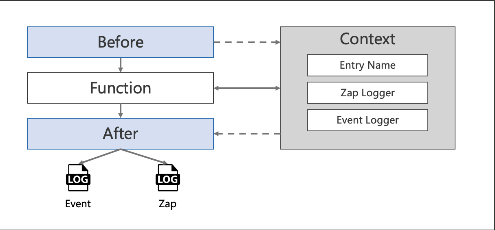

# Log interceptor
In this example, we will try to create unary and stream grpc server and client with log interceptor enabled.

<!-- START doctoc generated TOC please keep comment here to allow auto update -->
<!-- DON'T EDIT THIS SECTION, INSTEAD RE-RUN doctoc TO UPDATE -->
**Table of Contents**  *generated with [DocToc](https://github.com/thlorenz/doctoc)*

- [Quick start](#quick-start)
  - [Code](#code)
- [Options](#options)
  - [Encoding](#encoding)
  - [OutputPath](#outputpath)
  - [Context Usage](#context-usage)
- [Example](#example)
  - [Unary](#unary)
    - [Start server and client](#start-server-and-client)
    - [Output](#output)
    - [Code](#code-1)
  - [Stream](#stream)
    - [Start server and client](#start-server-and-client-1)
    - [Output](#output-1)
    - [Code](#code-2)

<!-- END doctoc generated TOC please keep comment here to allow auto update -->

## Quick start
Get rk-grpc package from the remote repository.

```go
go get -u github.com/rookie-ninja/rk-grpc
```

### Code
```go
import     "github.com/rookie-ninja/rk-grpc/interceptor/log/zap"
```

```go
    // *************************************
    // ********** Unary Server *************
    // *************************************
    opts := []grpc.ServerOption{
        grpc.ChainUnaryInterceptor(
            rkgrpclog.UnaryServerInterceptor(),
        ),
    }

    // *************************************
    // ********** Stream Server ************
    // *************************************
    opts := []grpc.ServerOption {
        grpc.ChainStreamInterceptor(
            // Add log interceptor
            rkgrpclog.StreamServerInterceptor(),
        ),
    }

    // *************************************
    // ********** Unary Client *************
    // *************************************
    opts := []grpc.DialOption {
        grpc.WithChainUnaryInterceptor(
            // Add log interceptor
            rkgrpclog.UnaryClientInterceptor(),
        ),
    }

    // **************************************
    // ********** Stream Client *************
    // **************************************
    opts := []grpc.DialOption{
        grpc.WithChainStreamInterceptor(
            // Add log interceptor
            rkgrpclog.StreamClientInterceptor(),
        ),
    }
```

## Options
Log interceptor will init rkquery.Event, zap.Logger and entryName which will be injected into request context before user function.
As soon as user function returns, interceptor will write the event into files.



| Name | Default | Description |
| ---- | ---- | ---- |
| WithEntryNameAndType(entryName, entryType string) | entryName=grpc, entryType=grpc | entryName and entryType will be used to distinguish options if there are multiple interceptors in single process. |
| WithZapLoggerEntry(zapLoggerEntry *rkentry.ZapLoggerEntry) | [rkentry.GlobalAppCtx.GetZapLoggerEntryDefault()](https://github.com/rookie-ninja/rk-entry/blob/master/entry/context.go) | Zap logger would print to stdout with console encoding type. |
| WithEventLoggerEntry(eventLoggerEntry *rkentry.EventLoggerEntry) | [rkentry.GlobalAppCtx.GetEventLoggerEntryDefault()](https://github.com/rookie-ninja/rk-entry/blob/master/entry/context.go) | Event logger would print to stdout with console encoding type. |
| WithZapLoggerEncoding(ec int) | rkgrpclog.ENCODING_CONSOLE | rkgrpclog.ENCODING_CONSOLE and rkgrpclog.ENCODING_JSON are available options. |
| WithZapLoggerOutputPaths(path ...string) | stdout | Both absolute path and relative path is acceptable. Current working directory would be used if path is relative. |
| WithEventLoggerEncoding(ec int) | rkgrpclog.ENCODING_CONSOLE | rkgrpclog.ENCODING_CONSOLE and rkgrpclog.ENCODING_JSON are available options. |
| WithEventLoggerOutputPaths(path ...string) | stdout | Both absolute path and relative path is acceptable. Current working directory would be used if path is relative. |

```go
    // ********************************************
    // ********** Enable interceptors *************
    // ********************************************
    opts := []grpc.ServerOption{
        grpc.ChainUnaryInterceptor(
            rkgrpclog.UnaryServerInterceptor(
                // Entry name and entry type will be used for distinguishing interceptors. Recommended.
                // rkgrpclog.WithEntryNameAndType("greeter", "grpc"),
                //
                // Zap logger would be logged as JSON format.
                // rkgrpclog.WithZapLoggerEncoding(rkgrpclog.ENCODING_JSON),
                //
                // Event logger would be logged as JSON format.
                // rkgrpclog.WithEventLoggerEncoding(rkgrpclog.ENCODING_JSON),
                //
                // Zap logger would be logged to specified path.
                // rkgrpclog.WithZapLoggerOutputPaths("logs/server-zap.log"),
                //
                // Event logger would be logged to specified path.
                // rkgrpclog.WithEventLoggerOutputPaths("logs/server-event.log"),
            ),
        ),
    }
```

### Encoding
- CONSOLE
No options needs to be provided. 
```shell script
------------------------------------------------------------------------
endTime=2021-06-21T22:20:36.823392+08:00
startTime=2021-06-21T22:20:36.823374+08:00
elapsedNano=18272
timezone=CST
ids={"eventId":"15f1c8ba-f0ec-4ed6-9a72-ce190f97982c"}
app={"appName":"rk","appVersion":"v0.0.0","entryName":"grpcEntry","entryType":"grpc"}
env={"arch":"amd64","az":"*","domain":"*","hostname":"lark.local","localIP":"192.168.101.5","os":"darwin","realm":"*","region":"*"}
payloads={"grpcMethod":"SayHello","grpcService":"Greeter","grpcType":"unaryServer","gwMethod":"","gwPath":"","gwScheme":"","gwUserAgent":""}
error={}
counters={}
pairs={}
timing={}
remoteAddr=localhost:59461
operation=/Greeter/SayHello
resCode=OK
eventStatus=Ended
EOE
```

- JSON
```go
    // ********************************************
    // ********** Enable interceptors *************
    // ********************************************
    opts := []grpc.ServerOption{
        grpc.ChainUnaryInterceptor(
            rkgrpclog.UnaryServerInterceptor(
                // Zap logger would be logged as JSON format.
                rkgrpclog.WithZapLoggerEncoding(rkgrpclog.ENCODING_JSON),
                //
                // Event logger would be logged as JSON format.
                rkgrpclog.WithEventLoggerEncoding(rkgrpclog.ENCODING_JSON),
            ),
        ),
    }
```
```json
{"endTime": "2021-06-21T02:49:32.681+0800", "startTime": "2021-06-21T02:49:32.681+0800", "elapsedNano": 18291, "timezone": "CST", "ids": {"eventId":"a195a383-d134-439c-9fd5-455fe4d133fd"}, "app": {"appName":"rkApp","appVersion":"v0.0.0","entryName":"grpcEntry","entryType":"grpc"}, "env": {"arch":"amd64","az":"*","domain":"*","hostname":"lark.local","localIP":"10.8.0.6","os":"darwin","realm":"*","region":"*"}, "payloads": {"grpcMethod":"SayHello","grpcService":"Greeter","grpcType":"unaryServer","gwMethod":"","gwPath":"","gwScheme":"","gwUserAgent":""}, "error": {}, "counters": {}, "pairs": {}, "timing": {}, "remoteAddr": "localhost:50748", "operation": "/Greeter/SayHello", "eventStatus": "Ended", "resCode": "OK"}
```

### OutputPath
- Stdout
No options needs to be provided. 

- Files
```go
    // ********************************************
    // ********** Enable interceptors *************
    // ********************************************
    opts := []grpc.ServerOption{
        grpc.ChainUnaryInterceptor(
            rkgrpclog.UnaryServerInterceptor(
                // Zap logger would be logged to specified path.
                rkgrpclog.WithZapLoggerOutputPaths("logs/server-zap.log"),

                // Event logger would be logged to specified path.
                rkgrpclog.WithEventLoggerOutputPaths("logs/server-event.log"),
            ),
        ),
    }
```

### Context Usage
| Name | Functionality |
| ------ | ------ |
| rkgrpcctx.GetLogger(context.Context) | Get logger generated by log interceptor. If there are X-Request-Id or X-Trace-Id as headers in incoming and outgoing metadata, then loggers will has requestId and traceId attached by default. |
| rkgrpcctx.GetEvent(context.Context) | Get event generated by log intercetor. Event would be printed as soon as RPC finished. ClientStream is a little bit tricky. Please refer rkgrpcctx.FinishClientStream() function for details. |
| rkgrpcctx.GetIncomingHeaders(context.Context) | Get incoming header. ClientStream is a little bit tricky, please use stream.Header() instead. |
| rkgrpcctx.AddHeaderToClient(ctx, "k", "v") | Add k/v to headers which would be sent to client. |
| rkgrpcctx.AddHeaderToServer(ctx, "k", "v") | Add k/v to headers which would be sent to server. |

## Example
### Unary
Create a simple unary server and client with bellow protocol buffer files.
- [greeter.proto](../proto/greeter.proto)

#### Start server and client
```shell script
$ go run greeter-server.go
```
```shell script
$ go run greeter-client.go
```

#### Output
- Server side (zap & event)
```shell script
2021-06-23T23:14:19.112+0800    INFO    logging/greeter-server.go:60    Received request from client.
```
```shell script
------------------------------------------------------------------------
endTime=2021-06-23T23:14:19.113101+08:00
startTime=2021-06-23T23:14:19.112939+08:00
elapsedNano=162050
timezone=CST
ids={"eventId":"c1f25000-b724-42f9-b820-7dc79d14d3e7"}
app={"appName":"rk","appVersion":"v0.0.0","entryName":"grpc","entryType":"grpc"}
env={"arch":"amd64","az":"*","domain":"*","hostname":"lark.local","localIP":"10.8.0.2","os":"darwin","realm":"*","region":"*"}
payloads={"grpcMethod":"SayHello","grpcService":"Greeter","grpcType":"unaryServer","gwMethod":"","gwPath":"","gwScheme":"","gwUserAgent":""}
error={}
counters={}
pairs={"rk-key":"rk-value"}
timing={}
remoteAddr=localhost:53603
operation=/Greeter/SayHello
resCode=OK
eventStatus=Ended
EOE
```

- Client side (zap & event)
```shell script
2021-06-23T23:14:19.115+0800    INFO    logging/greeter-client.go:59    [Message]: Hello rk-dev!
```
```shell script
------------------------------------------------------------------------
endTime=2021-06-23T23:14:19.115602+08:00
startTime=2021-06-23T23:14:19.11139+08:00
elapsedNano=4211992
timezone=CST
ids={"eventId":"546adc7a-1dc0-4611-af0b-bfa389b8d383"}
app={"appName":"rk","appVersion":"v0.0.0","entryName":"grpc","entryType":"grpc"}
env={"arch":"amd64","az":"*","domain":"*","hostname":"lark.local","localIP":"10.8.0.2","os":"darwin","realm":"*","region":"*"}
payloads={"grpcMethod":"SayHello","grpcService":"Greeter","grpcType":"unaryClient","remoteIp":"localhost","remotePort":"8080"}
error={}
counters={}
pairs={}
timing={}
remoteAddr=localhost:8080
operation=/Greeter/SayHello
resCode=OK
eventStatus=Ended
EOE
```

#### Code
- [greeter-server.go](greeter-server/greeter-server.go)
- [greeter-client.go](greeter-client/greeter-client.go)

### Stream
Create a simple stream server and client with bellow protocol buffer files.
- [chat.proto](../proto/chat.proto)

```go
// The bidirectional communication between client and server.
//
//     +--------+                    +--------+
//     | Client |                    | Server |
//     +--------+                    +--------+
//         |                             |
//         |             Hi!             |
//         |-------------------------->>>|
//         |                             |
//         |      Nice to meet you!      |
//         |-------------------------->>>|
//         |                             |
//         |             Hi!             |
//         |<<<--------------------------|
//         |                             |
//         |    Nice to meet you too!    |
//         |<<<--------------------------|
```

#### Start server and client
```shell script
$ go run chat-server.go
```
```shell script
$ go run chat-client.go
```

#### Output
- Server side (zap & event)
```shell script
2021-06-23T23:19:24.656+0800    INFO    logging/chat-server.go:91       [From client]: Hi!
2021-06-23T23:19:24.656+0800    INFO    logging/chat-server.go:91       [From client]: Nice to meet you!
```
```shell script
------------------------------------------------------------------------
endTime=2021-06-23T23:19:24.656495+08:00
startTime=2021-06-23T23:19:24.656247+08:00
elapsedNano=248482
timezone=CST
ids={"eventId":"531a804b-49de-4535-9ef3-b13962bb76dc"}
app={"appName":"rk","appVersion":"v0.0.0","entryName":"grpc","entryType":"grpc"}
env={"arch":"amd64","az":"*","domain":"*","hostname":"lark.local","localIP":"10.8.0.2","os":"darwin","realm":"*","region":"*"}
payloads={"grpcMethod":"Say","grpcService":"Chat","grpcType":"streamServer","gwMethod":"","gwPath":"","gwScheme":"","gwUserAgent":""}
error={}
counters={}
pairs={}
timing={}
remoteAddr=localhost:53636
operation=/Chat/Say
resCode=OK
eventStatus=Ended
EOE
```

- Client side (zap & event)
```shell script
2021-06-23T23:19:24.658+0800    INFO    logging/chat-client.go:98       [From server]: Hi!
2021-06-23T23:19:24.658+0800    INFO    logging/chat-client.go:98       [From server]: Nice to meet you too!
```
```shell script
------------------------------------------------------------------------
endTime=2021-06-23T23:19:24.655483+08:00
startTime=2021-06-23T23:19:24.655401+08:00
elapsedNano=81912
timezone=CST
ids={"eventId":"3c47517a-0dc6-409c-8025-af6f83f9f6d3"}
app={"appName":"rk","appVersion":"v0.0.0","entryName":"grpc","entryType":"grpc"}
env={"arch":"amd64","az":"*","domain":"*","hostname":"lark.local","localIP":"10.8.0.2","os":"darwin","realm":"*","region":"*"}
payloads={"grpcMethod":"Say","grpcService":"Chat","grpcType":"streamClient","remoteIp":"localhost","remotePort":"8080"}
error={}
counters={}
pairs={}
timing={}
remoteAddr=localhost:8080
operation=/Chat/Say
resCode=OK
eventStatus=Ended
EOE
```

#### Code
- [chat-server.go](chat-server/chat-server.go)
- [chat-client.go](chat-client/chat-client.go)

