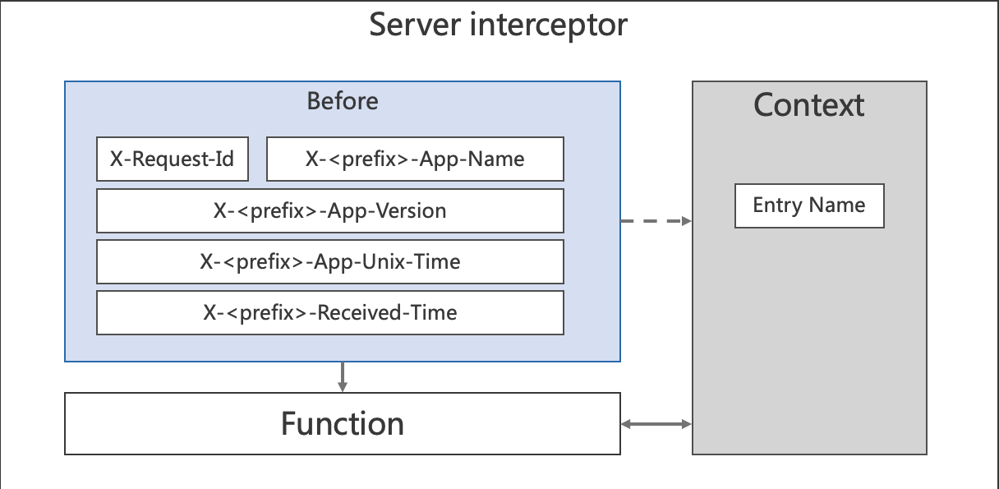

# Meta interceptor
In this example, we will try to create unary grpc server and client with meta interceptor enabled.

Meta interceptor will send bellow headers to client by default.

| Header key | Description |
| ---- | ---- |
| X-Request-Id | Request id generated by the interceptor. |
| X-[Prefix]-App | Application name. |
| X-[Prefix]-App-Version | Version of application. |
| X-[Prefix]-App-Unix-Time | Unix time of current application. |
| X-[Prefix]-Request-Received-Time | Time of current request received by application. |

<!-- START doctoc generated TOC please keep comment here to allow auto update -->
<!-- DON'T EDIT THIS SECTION, INSTEAD RE-RUN doctoc TO UPDATE -->
**Table of Contents**  *generated with [DocToc](https://github.com/thlorenz/doctoc)*

- [Quick start](#quick-start)
  - [Code](#code)
- [Options](#options)
  - [Context Usage](#context-usage)
- [Override RequestId](#override-requestid)
- [Override AppName and AppVersion](#override-appname-and-appversion)
- [Example](#example)
  - [Unary](#unary)
    - [Start server and client](#start-server-and-client)
    - [Output](#output)
    - [Code](#code-1)

<!-- END doctoc generated TOC please keep comment here to allow auto update -->

## Quick start
Get rk-grpc package from the remote repository.

```go
go get -u github.com/rookie-ninja/rk-grpc
```

### Code
Add rkgrpcmeta.UnaryServerInterceptor() meta with option.

```go
import     "github.com/rookie-ninja/rk-grpc/interceptor/meta"
```
```go
    // *************************************
    // ********** Unary Server *************
    // *************************************
    opts := []grpc.ServerOption{
        grpc.ChainUnaryInterceptor(
            // Add meta interceptor
            rkgrpcmeta.UnaryServerInterceptor(),
        ),
    }

    // *************************************
    // ********** Stream Server ************
    // *************************************
    opts := []grpc.ServerOption {
        grpc.ChainStreamInterceptor(
            // Add meta interceptor
            rkgrpcmeta.StreamServerInterceptor(),
        ),
    }
```

## Options
Meta interceptor is only available on server side. The interceptor will send bellow headers back to client.

- X-Request-Id: Generated by [rkcommon.GenerateRequestId()](https://github.com/rookie-ninja/rk-common/blob/master/common/common.go)
- X-RK-App-Name: Retrieved from [rkentry.GlobalAppCtx.GetAppInfoEntry().AppName](https://github.com/rookie-ninja/rk-entry#appinfoentry)
- X-RK-App-Version: Retrieved from [rkentry.GlobalAppCtx.GetAppInfoEntry().Version](https://github.com/rookie-ninja/rk-entry#appinfoentry)
- X-RK-Unix-Time: Server time when request arrives.
- X-RK-Received-Time: Server time when request arrives.



| Name | Description | Default Values |
| ---- | ---- | ---- |
| rkgrpcmeta.WithEntryNameAndType(entryName, entryType string) | Provide entry name and type if there are multiple meta interceptors needs to be used. | grpcEntry, grpc |
| rkgrpcmeta.WithPrefix(prefix string) | Provide prefix of meta header | RK |

```go
    // ********************************************
    // ********** Enable interceptors *************
    // ********************************************
    opts := []grpc.ServerOption{
        grpc.ChainUnaryInterceptor(
            rkgrpclog.UnaryServerInterceptor(),
            // Add meta interceptor
            rkgrpcmeta.UnaryServerInterceptor(
                // Entry name and entry type will be used for distinguishing interceptors. Recommended.
                // rkgrpcmeta.WithEntryNameAndType("greeter", "grpc"),
                //
                // We will replace X-<Prefix>-XXX with prefix user provided.
                // rkgrpcmeta.WithPrefix("Dog"),
            ),
        ),
    }
```
```shell script
# Print out headers from server on client side.
x-rk-app-unix-time: [2021-06-22T14:42:03.855569+08:00]
x-request-id: [f562f124-abbc-4804-b8a4-40848910b744]
x-rk-app-name: [rkApp]
x-rk-received-time: [2021-06-22T14:42:03.855569+08:00]
content-type: [application/grpc]
x-rk-app-version: [v0.0.0]
```

### Context Usage
| Name | Functionality |
| ------ | ------ |
| rkgrpcctx.GetLogger(context.Context) | Get logger generated by log interceptor. If there are X-Request-Id or X-Trace-Id as headers in incoming and outgoing metadata, then loggers will has requestId and traceId attached by default. |
| rkgrpcctx.GetEvent(context.Context) | Get event generated by log intercetor. Event would be printed as soon as RPC finished. ClientStream is a little bit tricky. Please refer rkgrpcctx.FinishClientStream() function for details. |
| rkgrpcctx.GetIncomingHeaders(context.Context) | Get incoming header. ClientStream is a little bit tricky, please use stream.Header() instead. |
| rkgrpcctx.AddHeaderToClient(ctx, "k", "v") | Add k/v to headers which would be sent to client. |
| rkgrpcctx.AddHeaderToServer(ctx, "k", "v") | Add k/v to headers which would be sent to server. |

## Override RequestId
In this example, we will try to override X-Request-Id header with our own. We will send both auto generated requestId and user
requestId to client.

Otherwise, if log interceptor was enabled, we will pick the latest one and attach to event logger and zap logger.

```go
    rkgrpcctx.AddHeaderToClient(ctx, rkgrpcctx.RequestIdKey, "this-is-my-request-id-overridden")
```

```shell script
# Headers sent from server.
x-rk-app-name: [rkApp]
x-rk-app-version: [v0.0.0]
x-rk-app-unix-time: [2021-06-22T18:55:57.080544+08:00]
x-rk-received-time: [2021-06-22T18:55:57.080544+08:00]
x-request-id: [ff111c1d-368e-4dc5-b50d-761499476166 this-is-my-request-id-overridden]
content-type: [application/grpc]
```

If log interceptor was enabled, we will pick the latest one and attach to event logger and zap logger.
```shell script
# Event logger
------------------------------------------------------------------------
endTime=2021-06-22T18:55:57.080558+08:00
startTime=2021-06-22T18:55:57.08053+08:00
elapsedNano=28018
timezone=CST
ids={"eventId":"this-is-my-request-id-overridden","requestId":"this-is-my-request-id-overridden"}
app={"appName":"rkApp","appVersion":"v0.0.0","entryName":"grpcEntry","entryType":"grpc"}
env={"arch":"amd64","az":"*","domain":"*","hostname":"lark.local","localIP":"10.8.0.2","os":"darwin","realm":"*","region":"*"}
payloads={"grpcMethod":"SayHello","grpcService":"Greeter","grpcType":"unaryServer","gwMethod":"","gwPath":"","gwScheme":"","gwUserAgent":""}
error={}
counters={}
pairs={}
timing={}
remoteAddr=localhost:64499
operation=/Greeter/SayHello
resCode=OK
eventStatus=Ended
EOE
```

## Override AppName and AppVersion
AppName and AppVersion was retrieved from [rkentry.GlobalAppCtx.GetAppInfoEntry().AppName](https://github.com/rookie-ninja/rk-entry#appinfoentry) and [rkentry.GlobalAppCtx.GetAppInfoEntry().Version](https://github.com/rookie-ninja/rk-entry#appinfoentry).

Override it before grpc server starts.

```go
func main() {
    ...
    // 0: Override AppName and AppVersion
    rkentry.GlobalAppCtx.GetAppInfoEntry().AppName = "demo-app"
    rkentry.GlobalAppCtx.GetAppInfoEntry().Version = "demo-version"

    // 1: Create grpc server
    server := startGreeterServer(opts...)
    ...
}
```

```shell script
# Headers sent from server
x-rk-app-name: [demo-app]
x-rk-app-version: [demo-version]
x-rk-app-unix-time: [2021-06-22T19:10:29.831625+08:00]
x-rk-received-time: [2021-06-22T19:10:29.831625+08:00]
x-request-id: [53365a2c-b0e1-4977-8b84-2b2374434a0f this-is-my-request-id-overridden]
content-type: [application/grpc]
```

## Example
### Unary
Create a simple unary server and client with bellow protocol buffer files. We will enable log interceptor at the same time.
- [greeter.proto](../proto/greeter.proto)

#### Start server and client
```shell script
$ go run greeter-server.go
```
```shell script
$ go run greeter-client.go
```

#### Output
- Server side (zap & event)
```shell script
2021-06-24T00:56:04.977+0800    INFO    meta/greeter-server.go:61  Received request from client.   {"requestId": "634809bc-e37d-4b7f-afaf-332ba81e02aa"}
```
```shell script
------------------------------------------------------------------------
endTime=2021-06-24T00:56:04.977444+08:00
startTime=2021-06-24T00:56:04.977341+08:00
elapsedNano=102533
timezone=CST
ids={"eventId":"634809bc-e37d-4b7f-afaf-332ba81e02aa","requestId":"634809bc-e37d-4b7f-afaf-332ba81e02aa"}
app={"appName":"rk","appVersion":"v0.0.0","entryName":"grpc","entryType":"grpc"}
env={"arch":"amd64","az":"*","domain":"*","hostname":"lark.local","localIP":"10.8.0.2","os":"darwin","realm":"*","region":"*"}
payloads={"grpcMethod":"SayHello","grpcService":"Greeter","grpcType":"unaryServer","gwMethod":"","gwPath":"","gwScheme":"","gwUserAgent":""}
error={}
counters={}
pairs={}
timing={}
remoteAddr=localhost:55225
operation=/Greeter/SayHello
resCode=OK
eventStatus=Ended
EOE
```

- Client side (zap & event)
```shell script
2021-06-24T00:56:04.979+0800    INFO    meta/greeter-client.go:42  [Message]: Hello rk-dev!        {"requestId": "634809bc-e37d-4b7f-afaf-332ba81e02aa"}
```
```shell script
------------------------------------------------------------------------
endTime=2021-06-24T00:56:04.979146+08:00
startTime=2021-06-24T00:56:04.976445+08:00
elapsedNano=2701892
timezone=CST
ids={"eventId":"634809bc-e37d-4b7f-afaf-332ba81e02aa","requestId":"634809bc-e37d-4b7f-afaf-332ba81e02aa"}
app={"appName":"rk","appVersion":"v0.0.0","entryName":"grpc","entryType":"grpc"}
env={"arch":"amd64","az":"*","domain":"*","hostname":"lark.local","localIP":"10.8.0.2","os":"darwin","realm":"*","region":"*"}
payloads={"grpcMethod":"SayHello","grpcService":"Greeter","grpcType":"unaryClient","remoteIp":"localhost","remotePort":"8080"}
error={}
counters={}
pairs={}
timing={}
remoteAddr=localhost:8080
operation=/Greeter/SayHello
resCode=OK
eventStatus=Ended
EOE
```

#### Code
- [greeter-server.go](greeter-server.go)
- [greeter-client.go](greeter-client.go)
