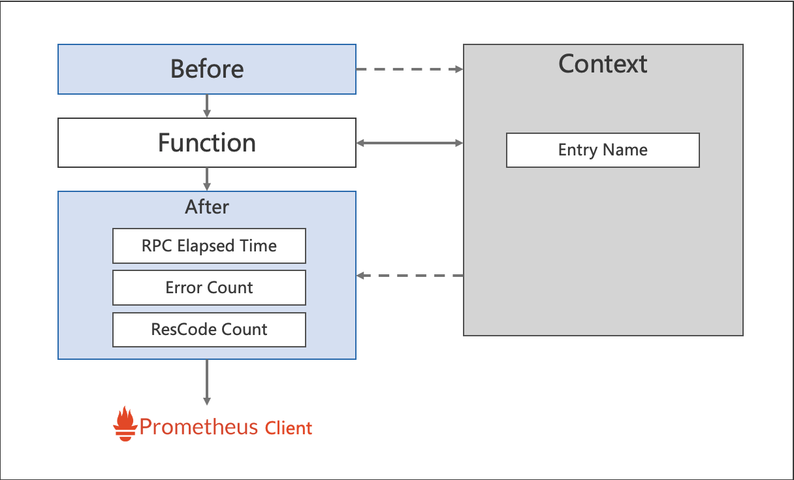

# Metrics interceptor
In this example, we will try to create unary grpc server and client with metrics interceptor enabled.

Metrics interceptor will collect bellow metrics with prometheus data format.
- RPC elapsed
- RPC error count
- RPC response code count

Users need to start a prometheus client locally export the data.
[rk-prom](https://github.com/rookie-ninja/rk-prom) would be a good option start prometheus client easily.

<!-- START doctoc generated TOC please keep comment here to allow auto update -->
<!-- DON'T EDIT THIS SECTION, INSTEAD RE-RUN doctoc TO UPDATE -->
**Table of Contents**  *generated with [DocToc](https://github.com/thlorenz/doctoc)*

- [Quick start](#quick-start)
  - [Code](#code)
- [Options](#options)
  - [Override namespace and subsystem](#override-namespace-and-subsystem)
  - [Override Registerer](#override-registerer)
  - [Context Usage](#context-usage)
- [Example](#example)
  - [Start server and client](#start-server-and-client)
  - [Output](#output)
  - [Code](#code-1)

<!-- END doctoc generated TOC please keep comment here to allow auto update -->

## Quick start
Get rk-grpc package from the remote repository.

### Code
```go
import     "github.com/rookie-ninja/rk-grpc/interceptor/metrics/prom"
```
```go
    // *************************************
    // ********** Unary Server *************
    // *************************************
    opts := []grpc.ServerOption{
        grpc.ChainUnaryInterceptor(
            // Add metrics interceptor
            rkgrpcmetrics.UnaryServerInterceptor(
                // Entry name and entry type will be used for distinguishing interceptors. Recommended.
                // rkgrpcmetrics.WithEntryNameAndType("greeter", "grpc"),
                //
                // Provide new prometheus registerer.
                // Default value is prometheus.DefaultRegisterer
                // rkgrpcmetrics.WithRegisterer(prometheus.NewRegistry()),
            ),
        ),
    }

    // *************************************
    // ********** Stream Server ************
    // *************************************
    opts := []grpc.ServerOption{
        grpc.ChainStreamInterceptor(
            // Add metrics interceptor
            rkgrpcmetrics.StreamServerInterceptor(
                // Entry name and entry type will be used for distinguishing interceptors. Recommended.
                // rkgrpcmetrics.WithEntryNameAndType("greeter", "grpc"),
                //
                // Provide new prometheus registerer.
                // Default value is prometheus.DefaultRegisterer
                // rkgrpcmetrics.WithRegisterer(prometheus.NewRegistry()),
            ),
        ),
    }

    // ************************************
    // ********** Unary Client ************
    // ************************************
    opts := []grpc.DialOption{
        grpc.WithChainUnaryInterceptor(
            // Add metrics interceptor
            rkgrpcmetrics.UnaryClientInterceptor(
                // Entry name and entry type will be used for distinguishing interceptors. Recommended.
                // rkgrpcmetrics.WithEntryNameAndType("greeter", "grpc"),
                //
                // Provide new prometheus registerer.
                // Default value is prometheus.DefaultRegisterer
                // rkgrpcmetrics.WithRegisterer(prometheus.NewRegistry()),
            ),
        ),
        grpc.WithInsecure(),
        grpc.WithBlock(),
    }

    // *************************************
    // ********** Stream Client ************
    // *************************************
    opts := []grpc.DialOption{
        grpc.WithChainStreamInterceptor(
            // Add metrics interceptor
            rkgrpcmetrics.StreamClientInterceptor(
                // Entry name and entry type will be used for distinguishing interceptors. Recommended.
                // rkgrpcmetrics.WithEntryNameAndType("greeter", "grpc"),
                //
                // Provide new prometheus registerer.
                // Default value is prometheus.DefaultRegisterer
                // rkgrpcmetrics.WithRegisterer(prometheus.NewRegistry()),
            ),
        ),
        grpc.WithInsecure(),
        grpc.WithBlock(),
    }
```

## Options
In order to define prometheus style metrics, we need to define <namespace> and <subsystem>.
- namespace: rkentry.GlobalAppCtx().AppName ("rk" will be used by default.)
- subsystem: entryName (Provided as interceptor option. "grpc" will be used by default.)

| Name | Description | Default Values |
| ---- | ---- | ---- |
| rkgrpcmetrics.WithEntryNameAndType(entryName, entryType string) | Provide entry name and type if there are multiple extension interceptors needs to be used. | grpc, grpc |
| rkgrpcmetrics.WithRegisterer(registerer prometheus.Registerer) | Provide prometheus registerer. | prometheus.DefaultRegisterer |



### Override namespace and subsystem
```go
func main() {
    // Override app name which would replace namespace value in prometheus.
    rkentry.GlobalAppCtx.GetAppInfoEntry().AppName = "newApp"

    // ********************************************
    // ********** Enable interceptors *************
    // ********************************************
    opts := []grpc.ServerOption{
        grpc.ChainUnaryInterceptor(
            // Add metrics interceptor with entry name and entry type.
            // subsystem would be replaced with newEntry.
            rkgrpcmetrics.UnaryServerInterceptor(rkgrpcmetrics.WithEntryNameAndType("newEntry", "grpc")),
        ),
    }

    // 1: Create grpc server
    server := startGreeterServer(opts...)
    ...
}
```

### Override Registerer
```go
    // ********************************************
    // ********** Enable interceptors *************
    // ********************************************
    opts := []grpc.ServerOption{
        grpc.ChainUnaryInterceptor(
            // Add metrics interceptor
            rkgrpcmetrics.UnaryServerInterceptor(rkgrpcmetrics.WithRegisterer(prometheus.NewRegistry())),
        ),
    }
```

### Context Usage
| Name | Functionality |
| ------ | ------ |
| rkgrpcctx.GetLogger(context.Context) | Get logger generated by log interceptor. If there are X-Request-Id or X-Trace-Id as headers in incoming and outgoing metadata, then loggers will has requestId and traceId attached by default. |
| rkgrpcctx.GetEvent(context.Context) | Get event generated by log intercetor. Event would be printed as soon as RPC finished. ClientStream is a little bit tricky. Please refer rkgrpcctx.FinishClientStream() function for details. |
| rkgrpcctx.GetIncomingHeaders(context.Context) | Get incoming header. ClientStream is a little bit tricky, please use stream.Header() instead. |
| rkgrpcctx.AddHeaderToClient(ctx, "k", "v") | Add k/v to headers which would be sent to client. |
| rkgrpcctx.AddHeaderToServer(ctx, "k", "v") | Add k/v to headers which would be sent to server. |

## Example
### Start server and client
```shell script
$ go run greeter-server.go
```
```shell script
$ go run greeter-client.go
```

### Output
- Server: localhost:8081/metrics
```shell script
$ curl localhost:8081/metrics
...
# HELP rk_grpc_elapsedNano Summary for name:elapsedNano and labels:[entryName entryType realm region az domain instance appVersion appName grpcService grpcMethod restMethod restPath grpcType resCode]
# TYPE rk_grpc_elapsedNano summary
rk_grpc_elapsedNano{appName="rk",appVersion="v0.0.0",az="*",domain="*",entryName="grpc",entryType="grpc",grpcMethod="SayHello",grpcService="Greeter",grpcType="unaryServer",instance="lark.local",realm="*",region="*",resCode="OK",restMethod="",restPath="",quantile="0.5"} 3778
rk_grpc_elapsedNano{appName="rk",appVersion="v0.0.0",az="*",domain="*",entryName="grpc",entryType="grpc",grpcMethod="SayHello",grpcService="Greeter",grpcType="unaryServer",instance="lark.local",realm="*",region="*",resCode="OK",restMethod="",restPath="",quantile="0.9"} 3778
rk_grpc_elapsedNano{appName="rk",appVersion="v0.0.0",az="*",domain="*",entryName="grpc",entryType="grpc",grpcMethod="SayHello",grpcService="Greeter",grpcType="unaryServer",instance="lark.local",realm="*",region="*",resCode="OK",restMethod="",restPath="",quantile="0.99"} 3778
rk_grpc_elapsedNano{appName="rk",appVersion="v0.0.0",az="*",domain="*",entryName="grpc",entryType="grpc",grpcMethod="SayHello",grpcService="Greeter",grpcType="unaryServer",instance="lark.local",realm="*",region="*",resCode="OK",restMethod="",restPath="",quantile="0.999"} 3778
rk_grpc_elapsedNano_sum{appName="rk",appVersion="v0.0.0",az="*",domain="*",entryName="grpc",entryType="grpc",grpcMethod="SayHello",grpcService="Greeter",grpcType="unaryServer",instance="lark.local",realm="*",region="*",resCode="OK",restMethod="",restPath=""} 3778
rk_grpc_elapsedNano_count{appName="rk",appVersion="v0.0.0",az="*",domain="*",entryName="grpc",entryType="grpc",grpcMethod="SayHello",grpcService="Greeter",grpcType="unaryServer",instance="lark.local",realm="*",region="*",resCode="OK",restMethod="",restPath=""} 1
# HELP rk_grpc_errors counter for name:errors and labels:[entryName entryType realm region az domain instance appVersion appName grpcService grpcMethod restMethod restPath grpcType resCode]
# TYPE rk_grpc_errors counter
rk_grpc_errors{appName="rk",appVersion="v0.0.0",az="*",domain="*",entryName="grpc",entryType="grpc",grpcMethod="SayHello",grpcService="Greeter",grpcType="unaryServer",instance="lark.local",realm="*",region="*",resCode="OK",restMethod="",restPath=""} 1
# HELP rk_grpc_resCode counter for name:resCode and labels:[entryName entryType realm region az domain instance appVersion appName grpcService grpcMethod restMethod restPath grpcType resCode]
# TYPE rk_grpc_resCode counter
rk_grpc_resCode{appName="rk",appVersion="v0.0.0",az="*",domain="*",entryName="grpc",entryType="grpc",grpcMethod="SayHello",grpcService="Greeter",grpcType="unaryServer",instance="lark.local",realm="*",region="*",resCode="OK",restMethod="",restPath=""} 1
```
- Client: localhost:8082/metrics
```shell script
$ curl localhost:8082/metrics
...
# HELP rk_grpc_elapsedNano Summary for name:elapsedNano and labels:[entryName entryType realm region az domain instance appVersion appName grpcService grpcMethod restMethod restPath grpcType resCode]
# TYPE rk_grpc_elapsedNano summary
rk_grpc_elapsedNano{appName="rk",appVersion="v0.0.0",az="*",domain="*",entryName="grpc",entryType="grpc",grpcMethod="SayHello",grpcService="Greeter",grpcType="unaryClient",instance="lark.local",realm="*",region="*",resCode="OK",restMethod="",restPath="",quantile="0.5"} 2.062687e+06
rk_grpc_elapsedNano{appName="rk",appVersion="v0.0.0",az="*",domain="*",entryName="grpc",entryType="grpc",grpcMethod="SayHello",grpcService="Greeter",grpcType="unaryClient",instance="lark.local",realm="*",region="*",resCode="OK",restMethod="",restPath="",quantile="0.9"} 2.062687e+06
rk_grpc_elapsedNano{appName="rk",appVersion="v0.0.0",az="*",domain="*",entryName="grpc",entryType="grpc",grpcMethod="SayHello",grpcService="Greeter",grpcType="unaryClient",instance="lark.local",realm="*",region="*",resCode="OK",restMethod="",restPath="",quantile="0.99"} 2.062687e+06
rk_grpc_elapsedNano{appName="rk",appVersion="v0.0.0",az="*",domain="*",entryName="grpc",entryType="grpc",grpcMethod="SayHello",grpcService="Greeter",grpcType="unaryClient",instance="lark.local",realm="*",region="*",resCode="OK",restMethod="",restPath="",quantile="0.999"} 2.062687e+06
rk_grpc_elapsedNano_sum{appName="rk",appVersion="v0.0.0",az="*",domain="*",entryName="grpc",entryType="grpc",grpcMethod="SayHello",grpcService="Greeter",grpcType="unaryClient",instance="lark.local",realm="*",region="*",resCode="OK",restMethod="",restPath=""} 2.062687e+06
rk_grpc_elapsedNano_count{appName="rk",appVersion="v0.0.0",az="*",domain="*",entryName="grpc",entryType="grpc",grpcMethod="SayHello",grpcService="Greeter",grpcType="unaryClient",instance="lark.local",realm="*",region="*",resCode="OK",restMethod="",restPath=""} 1
# HELP rk_grpc_errors counter for name:errors and labels:[entryName entryType realm region az domain instance appVersion appName grpcService grpcMethod restMethod restPath grpcType resCode]
# TYPE rk_grpc_errors counter
rk_grpc_errors{appName="rk",appVersion="v0.0.0",az="*",domain="*",entryName="grpc",entryType="grpc",grpcMethod="SayHello",grpcService="Greeter",grpcType="unaryClient",instance="lark.local",realm="*",region="*",resCode="OK",restMethod="",restPath=""} 1
# HELP rk_grpc_resCode counter for name:resCode and labels:[entryName entryType realm region az domain instance appVersion appName grpcService grpcMethod restMethod restPath grpcType resCode]
# TYPE rk_grpc_resCode counter
rk_grpc_resCode{appName="rk",appVersion="v0.0.0",az="*",domain="*",entryName="grpc",entryType="grpc",grpcMethod="SayHello",grpcService="Greeter",grpcType="unaryClient",instance="lark.local",realm="*",region="*",resCode="OK",restMethod="",restPath=""} 1
```

### Code
- [greeter-server.go](server/greeter-server.go)
- [greeter-client.go](client/greeter-client.go)