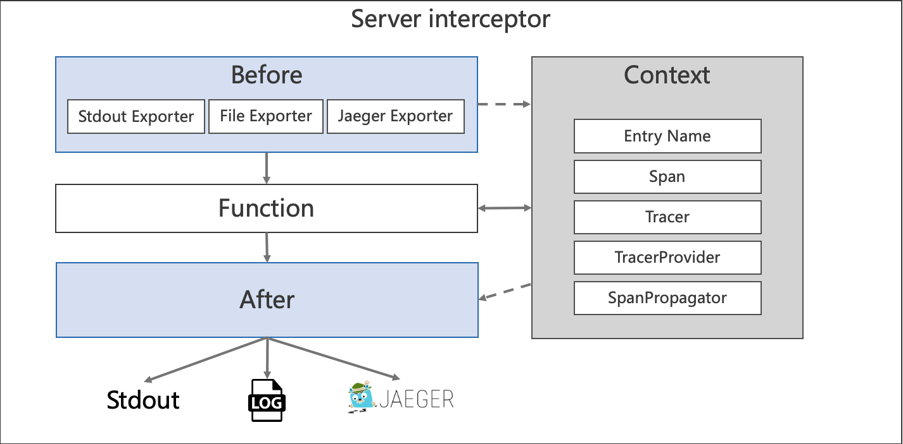
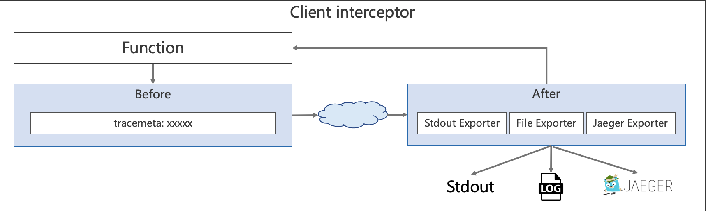
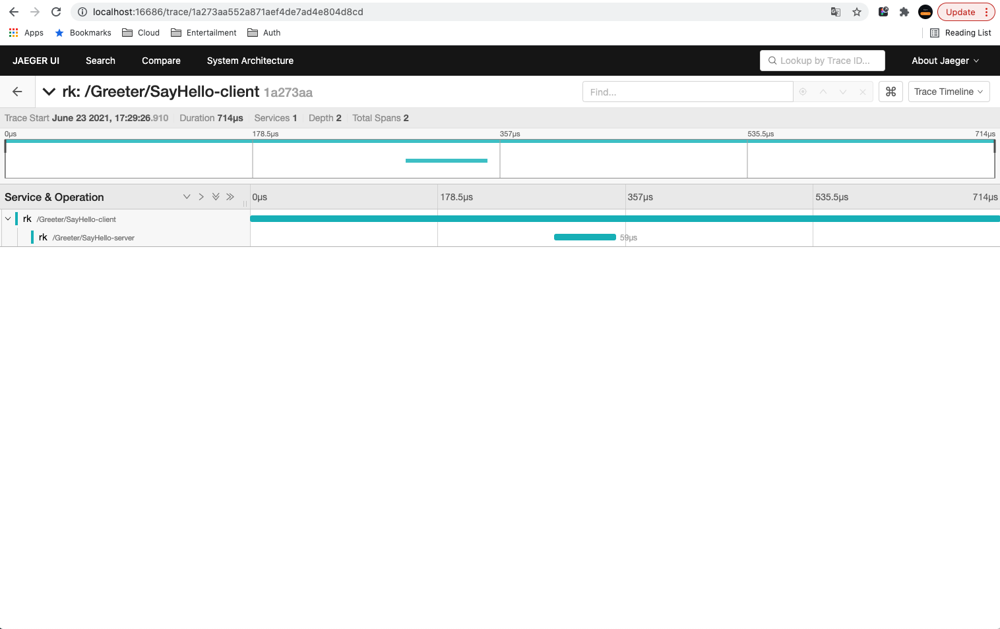

# Trace interceptor
In this example, we will try to create unary grpc server and client with trace interceptor enabled.

Trace interceptor has bellow options currently while exporting tracing information.

| Exporter | Description |
| ---- | ---- |
| Stdout | Export as JSON style. |
| Local file | Export as JSON style. |
| Jaeger |  In beta stage, export to jaeger collector only. |

**Please make sure panic interceptor to be added at last in chain of interceptors.**

<!-- START doctoc generated TOC please keep comment here to allow auto update -->
<!-- DON'T EDIT THIS SECTION, INSTEAD RE-RUN doctoc TO UPDATE -->
**Table of Contents**  *generated with [DocToc](https://github.com/thlorenz/doctoc)*

- [Quick start](#quick-start)
- [Options](#options)
  - [Exporter](#exporter)
    - [Stdout exporter](#stdout-exporter)
    - [File exporter](#file-exporter)
    - [Jaeger exporter](#jaeger-exporter)
- [Example](#example)
  - [Start server and client](#start-server-and-client)
  - [Output](#output)
    - [Stdout exporter](#stdout-exporter-1)
    - [Jaeger exporter](#jaeger-exporter-1)
  - [Code](#code)

<!-- END doctoc generated TOC please keep comment here to allow auto update -->

## Quick start
Get rk-grpc package from the remote repository.

```go
go get -u github.com/rookie-ninja/rk-grpc
```
```go
    // *************************************
    // ********** Unary Server *************
    // *************************************
    opts := []grpc.ServerOption{
        grpc.ChainUnaryInterceptor(
            // Add trace interceptor
            rkgrpctrace.UnaryServerInterceptor(
                // Entry name and entry type will be used for distinguishing interceptors. Recommended.
                // rkmidtrace.WithEntryNameAndType("greeter", "grpc"),
                //
                // Provide an exporter.
                // rkmidtrace.WithExporter(exporter),
                //
                // Provide propagation.TextMapPropagator
                // rkmidtrace.WithPropagator(<propagator>),
                // 
                // Provide SpanProcessor
                // rkmidtrace.WithSpanProcessor(<span processor>),
                // 
                // Provide TracerProvider
                // rkmidtrace.WithTracerProvider(<trace provider>),
            ),
        ),
    }

    // *************************************
    // ********** Stream Server ************
    // *************************************
    opts := []grpc.ServerOption{
        grpc.ChainStreamInterceptor(
            // Add trace interceptor
            rkgrpctrace.StreamServerInterceptor(
                // Entry name and entry type will be used for distinguishing interceptors. Recommended.
                // rkmidtrace.WithEntryNameAndType("greeter", "grpc"),
                //
                // Provide an exporter.
                // rkmidtrace.WithExporter(exporter),
                //
                // Provide propagation.TextMapPropagator
                // rkmidtrace.WithPropagator(<propagator>),
                // 
                // Provide SpanProcessor
                // rkmidtrace.WithSpanProcessor(<span processor>),
                // 
                // Provide TracerProvider
                // rkmidtrace.WithTracerProvider(<trace provider>),
            ),
        ),
    }
```

## Options
If client didn't enable trace interceptor, then server will create a new trace span by itself. If client sends a tracemeta to server, 
then server will use the same traceId.

| Name | Description | Default |
| ---- | ---- | ---- |
| rkmidtrace.WithEntryNameAndType(entryName, entryType string) | Provide entryName and entryType, recommended. | entryName=grpc, entryType=grpc |
| rkmidtrace.WithExporter(exporter sdktrace.SpanExporter) | User defined exporter. | [Stdout exporter](https://pkg.go.dev/go.opentelemetry.io/otel/exporters/stdout) with pretty print and disabled metrics |
| rkmidtrace.WithSpanProcessor(processor sdktrace.SpanProcessor) | User defined span processor. | [NewBatchSpanProcessor](https://pkg.go.dev/go.opentelemetry.io/otel/sdk/trace#NewBatchSpanProcessor) |
| rkmidtrace.WithPropagator(propagator propagation.TextMapPropagator) | User defined propagator. | [NewCompositeTextMapPropagator](https://pkg.go.dev/go.opentelemetry.io/otel/propagation#TextMapPropagator) |




### Exporter
#### Stdout exporter
```go
    // ****************************************
    // ********** Create Exporter *************
    // ****************************************

    // Export trace to stdout with utility function
    //
    // Bellow function would be while creation
    // set.Exporter, _ = stdout.NewExporter(
    //     stdout.WithPrettyPrint(),
    //     stdout.WithoutMetricExport())
    exporter := rkmidtrace.NewFileExporter("stdout")

    // Users can define own stdout exporter by themselves.
    exporter, _ := stdout.NewExporter(stdout.WithPrettyPrint(), stdout.WithoutMetricExport())
```

#### File exporter
```go
    // ****************************************
    // ********** Create Exporter *************
    // ****************************************

    // Export trace to local file system
    exporter := rkmidtrace.NewFileExporter("logs/trace.log")
```

#### Jaeger exporter
```go
    // ****************************************
    // ********** Create Exporter *************
    // ****************************************

    // Export trace to jaeger collector
    exporter := rkmidtrace.NewJaegerExporter("localhost:14368", "", "")
```

## Example
### Start server and client
```shell script
$ go run greeter-server.go
```
```shell script
$ go run greeter-client.go
```

### Output
#### Stdout exporter
If logger interceptor enabled, then traceId would be attached to event and zap logger.

- Server side trace log
```shell script
[
        {
                "SpanContext": {
                        "TraceID": "898ad20ad69998dc0bef2707ce5332d5",
                        "SpanID": "1a163e6bb2f96dcd",
                        "TraceFlags": "01",
                        "TraceState": null,
                        "Remote": false
                },
                ...
```

- Server side log (zap & event)
```shell script
2022-01-15T22:14:33.298+0800    INFO    server/greeter-server.go:79     Received client request!        {"requestId": "a5babb17-bb5e-4990-888d-ad6a7023f8d2", "traceId": "e491fe5d177eb9e2ec4849de923aeffc"}
------------------------------------------------------------------------
endTime=2022-01-15T22:14:33.29883+08:00
startTime=2022-01-15T22:14:33.298553+08:00
elapsedNano=277842
timezone=CST
ids={"eventId":"a5babb17-bb5e-4990-888d-ad6a7023f8d2","requestId":"a5babb17-bb5e-4990-888d-ad6a7023f8d2","traceId":"e491fe5d177eb9e2ec4849de923aeffc"}
app={"appName":"rk","appVersion":"","entryName":"greeter","entryType":"grpc"}
env={"arch":"amd64","az":"*","domain":"*","hostname":"lark.local","localIP":"10.8.0.2","os":"darwin","realm":"*","region":"*"}
payloads={"apiMethod":"","apiPath":"/Greeter/SayHello","apiProtocol":"","apiQuery":"","grpcMethod":"SayHello","grpcService":"Greeter","grpcType":"UnaryServer","gwMethod":"","gwPath":"","gwScheme":"","gwUserAgent":"","userAgent":""}
error={}
counters={}
pairs={}
timing={}
remoteAddr=127.0.0.1:63188
operation=/Greeter/SayHello
resCode=OK
eventStatus=Ended
EOE
```

- Client side trace log
```shell script
[
    {
        "SpanContext": {
                "TraceID": "e491fe5d177eb9e2ec4849de923aeffc",
                "SpanID": "aedfcb573dbc5d97",
                "TraceFlags": "01",
                "TraceState": "",
                "Remote": false
        },
        ...
```

- Client side log (zap & event)
```shell script
2022-01-15T22:14:33.299+0800    INFO    client/greeter-client.go:46     [Message]: Hello rk-dev!
```

#### Jaeger exporter


### Code
- [greeter-server.go](server/greeter-server.go)
- [greeter-client.go](client/greeter-client.go)